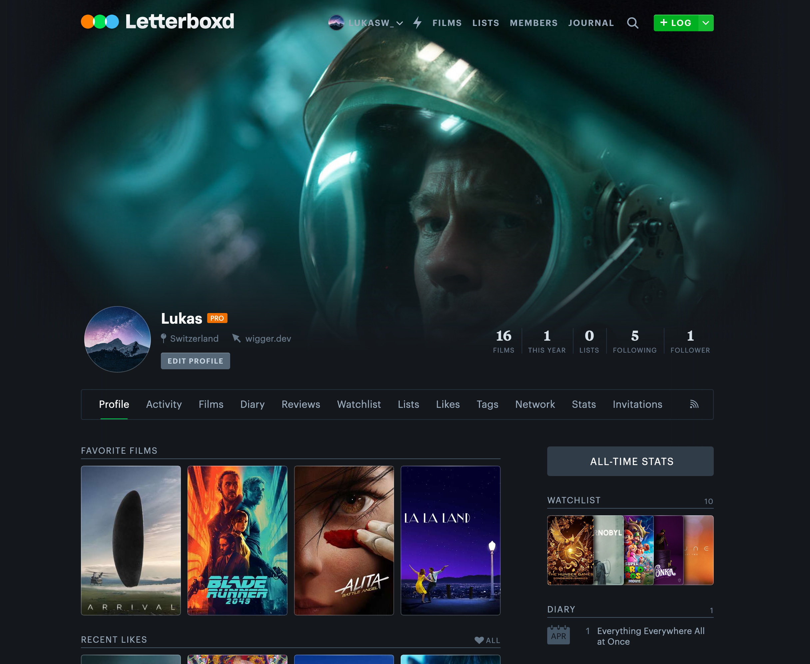

# Letterboxd-Backdrop
Browser extension that adds a custom backdrop image to your Letterboxd profile. The changes of the backdrop image are only made locally on your device and no modifications on letterboxd's servers are performed.

Note: This extension is not affiliated with Letterboxd in any way.



###  Getting Started

Install packages:

```bash
pnpm i
```

Build the extension:

```bash
pnpm build:all
```

### License

This program is licensed under the MIT-License. See the "LICENSE" file for more information